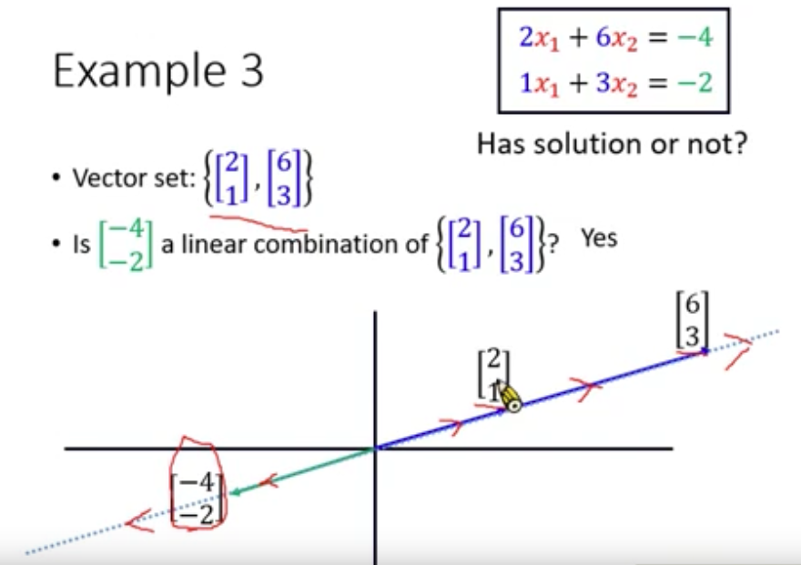
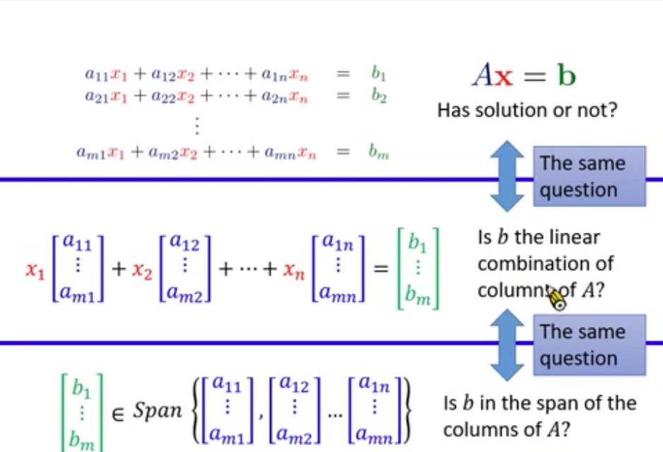
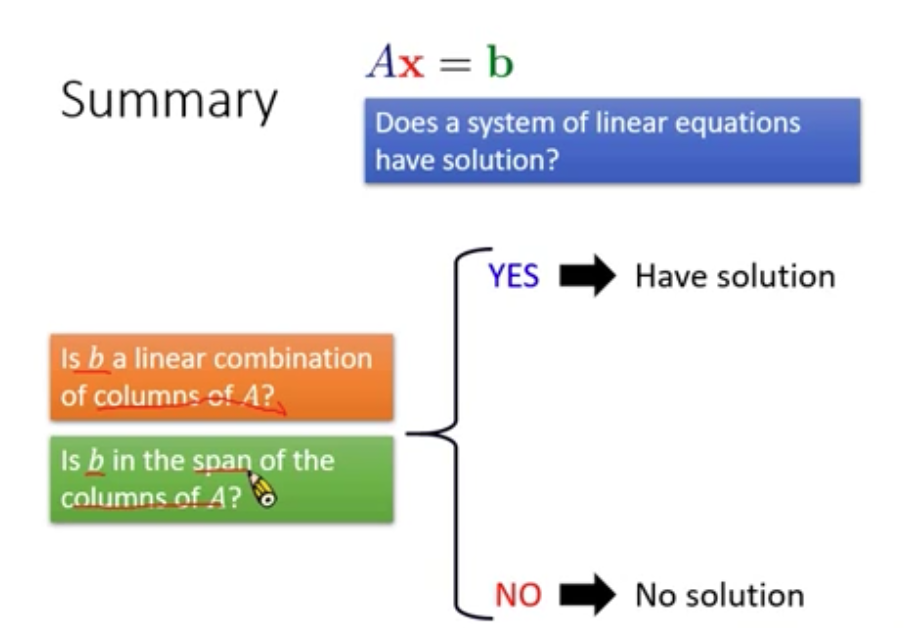

## 线性代数(Linear System)

### Lecture 1 简介
1. A System of linear equations(多元一次联立方程式)
2. 线性系统的两个属性
   1. 均匀性
   2. 叠加性
3. 应用
   1. **PageRank**(网页排名: 页面重要性)
   2. **computer graphics**(电脑绘图)
4. Determinants(行列式)
5. vector(向量)
6. set(集合)
7. Eigen(特征)
   1. 滤波器
   
### Lecture 2 System of linear equations
1. Terminology(术语)
   1. Domain(定义域): function 的所有输入
   2. Co-domain(对应域): function 的所有输出(可能输出)
   3. Range(值域): function 真正可以输出的集合(实际输出)
      1. 包含在对应域期间
   4. one-to-one(一对一): domain 和 range一样大
   5. Onto(映成) function: Co-domain = range
2. question
   1. Derivative(微分): 线性
   2. Integral(积分): 线性
3. A linear system is described by a system of linear equations（线性系统=多元一次联立方程式）

### Lecture 3 Vector
1. 术语
   1. vectors: A vector V is a set of number
   2. components: the entries of a vector
2. Vector Addition
   1. $$
         a = [a_1, a_1]
         \\
         b = [b_1, b_1]
         \\
         a + b = [a_1 + b_1, a_1 + b_2 + a_2]
      $$
3. Vector Set
   1. $$R^n: 所有的有n个元素的向量的集合$$
4. 向量特性

### Lecture 4 Matrix
1. 定义: 一组向量的集合
   1. zero matrix: 元素都是0的矩阵***0***
   2. Identity matrix(单位矩阵): 
      1. n = m
      2. 对角线是1, 其它都是0
   3. Transpose: n, m 互换
      * $$A^T$$

### Lecture 5 Matrix-vector Product（矩阵-向量相乘）
1. 多元一次联立方程式可转换为矩阵-向量相乘

### Lecture 6 Having Solution or not (多元一次联立方程式/线性系统是否有解)
1. 术语：
   1. linear combination：线性组合（坐标系中，两个是否能相加便成结果）
   2. span（增广矩阵）: A 进行span之后，是否包含b
      1. 将一个向量（非0）span之后，则是与该向量平行的直线
      2. 多个不平行向量（平面），span之后，是整个二维平面
   3. coefficients： 系数
2. 对于有无解
   1. 有解： consistent
   2. 无解： inconsistent
3. 两个不平行的vector，组合可以扫过整个二维空间，也就说肯定是有解的
   1. 三维
4. 总结