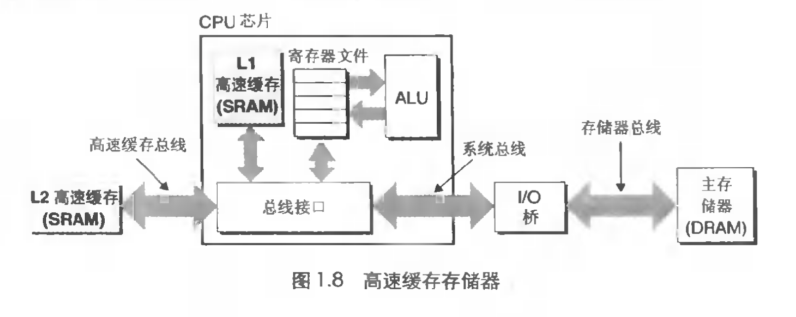
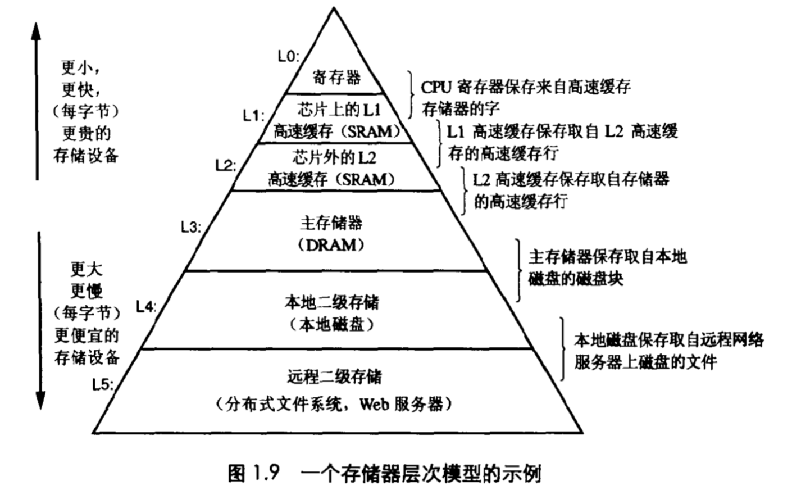
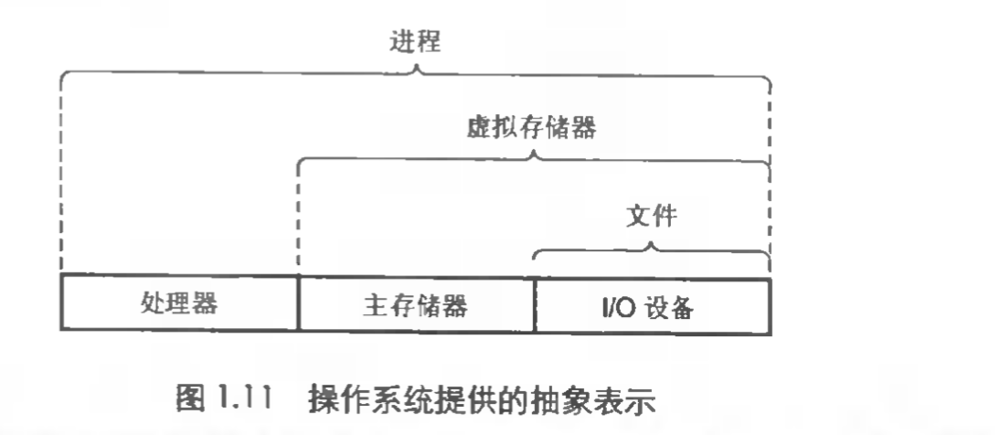

# 深入理解计算机系统

# 计算机系统漫游
## 1.1 信息就是位+上下文

系统中的所有信息--包括磁盘文件. 存储器中的程序, 存储器中存放的用户数据以及网络上传输的数据, 都是一串比特表示的

> Tips: C语言由贝尔实验室创建

* 比特: 位, 由0 / 1 表示
* 字节: 8个比特位1字节
* 

## 1.4 系统的硬件组成
**系统硬件组成**

* ALU: 算术/逻辑单元
* PC: 程序计数器, 字长大小的存储设备(寄存器)
* 寄存器文件: register file, 一个小的存储设备, 由一些字长大小的寄存器组成, 这些寄存器每个都有唯一的名字
* CUP: 中央处理单元
  * 解释(或执行)存储在主存中指令的引擎. 核心是PC. 任一时间点, PC都指向主存中的某条机器语言指令(内含其地址)
  * 从PC指向的存储器处读取指令, 解释指令中的位, 执行指令指示的简单操作, 然后更新PC指向下一条指令, 这条指令不一定在存储器中和刚刚执行的指令相邻
* USB: 通用串行总线
* 总线: 贯穿整个系统的是一组电子管道, 称作总线, 它携带信息字节并负责在各个部件间传递
* 主存: 一个临时存储设备, 在处理器执行程序时, 它被用来存放程序和程序处理的数据
  * 物理上来说: 是由一组DRAM(动态随机存取存储器)芯片组成
  * 逻辑上来说: 存储器由一个线性的字节数组组成, 每个字节都有自己唯一的地址(数组索引)
* DMA: 直接存储器存取

## 1.5 高速缓存
**高速缓存存储器**

* cache memories: 高速缓存, 存放处理器在不久的将来可能会需要的信息
* SRAM: 静态随机访问存取器

## 1.6 形成层次结构的存储设备
**存储器层次模型**

## 1.7 操作系统管理硬件

**操作系统提供的抽象表示**

* 上下文切换: 不同进程间交错执行, 操作系统实现这种交错执行的机制称为...
* 进程: 进程是操作系统对运行程序的一种抽象.
* 线程: 进程中的执行单元

## 1.9 重要主题

* Amdahl 定律: 要想显著加速整个系统, 必须提升全系统中相当大部分的速度
* 并发: 两个或多个事件在同一时间间隔发生
* 并行: 两个或者多个事件在同一时刻发生
* 超线程: 有时称为同时多线程

# 第一部分

> 未完待续...