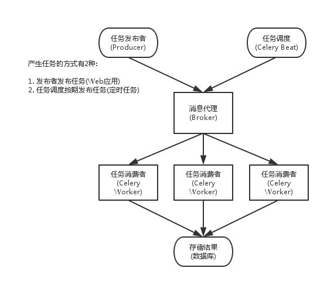

# 41-celery，RabbitMq

# Celery - 分布式任务队列

## 问题：

1. 讲下celery的作用及实现原理？
    * 分布式任务队列管理工具，通过它可以轻松的实现任务的异步处理
    * 使用场景
        * 异步任务
        * 定时任务
2. 为什么使用celery异步任务？（类似于为什么使用消息队列）
   1. 异步
   2. 解耦：解决流程直接的耦合性
   3. 削峰：对于流量高峰，把请求放到队列里面，然后至于每秒消费多少请求，就看自己的服务器处理能力，不至于服务器崩溃
3. RabbitMq重复消费的问题
   1. 在redis做一个标记
4. RabbitMq消息如何处理

## 知识点

1. 简介
    1. 一个由 Python 编写的简单、灵活、可靠的用来处理大量信息的分布式系统,
    2. 专注于实时任务处理，支持任务调度
    3. 一个分布式队列的管理工具
    4. Celery 本身不是任务队列，它是管理分布式任务队列的工具
    5. 提供了对多种语言的支持
    6. celery默认的并发方式是prefork,也就是多进程的方式，这里只是celery对multiprocessing.Pool进行了轻量的改造
2. 优点
    * 简单：一旦熟悉了celery的工作流程后，配置和使用还是比较简单的
    * 高可用：当任务执行失败或执行过程中发生连接中断，celery 会自动尝试重新执行任务
    * 快速：一个单进程的celery每分钟可处理上百万个任务
    * 灵活： 几乎celery的各个组件都可以被扩展及自定制，
        * 可以自制连接池、 序列化、压缩模式、日志、调度器、消费者、生产者、自动扩展、 中间人传输或更多。
3. 支持
   1. 中间人
     * RabbitMQ, Redis,
   2. 并发
      * Eventlet, gevent
      * 多线程/单线程
      * prefork（多进程）,
   3. 结果存储
      * AMQP, Redis
      * memcached, MongoDB， 关系型数据库
      * Apache Cassandra
   4.  序列化
      * zlib, bzip2 压缩
      * 密码学消息签名
      * pickle, json, yaml, msgpack
4. 架构
    1. Celery Beat
        * 是一个任务调度器，它以独立进程的形式存在。Celery beat 进程会读取配置文件的内容，周期性地将执行任务的请求发送给任务队列
        * Celery 系统自带的任务生产者
    2. Producer
        * 调用了Celery提供的API、函数或者装饰器而产生任务并交给任务队列处理的都是任务生产者
    3. Broker
        * 消息代理，或者叫作消息中间件，接受任务生产者发送过来的任务消息，存进队列再按序分发给任务消费方（通常是消息队列或者数据库）
    4. celery worker
        * 执行任务的一方，它负责接收处理任务中间方发来的任务处理请求，完成这些任务，并且返回任务处理的结果。
        * Celery worker 默认对应的就是操作系统中的一个进程，也可以是线程，协程
    5. 结果保存
        * 支持任务处理完后将状态信息和结果的保存，以供查询

            

*     启动
    * <span style="background-color: #ffaaaa"><span style="background-color: #ffaaaa">celery  -A celery_tasks.main  worker  -l info  # 执行celery指令</span></span>
    * $ celery -A tasks worker --loglevel=info

开始编写tasks.py：
```
_# tasks.py_import time

from celery import Celery

celery = Celery('tasks', broker='[redis://localhost:6379/0](redis://localhost:6379/0)')

@celery.task

def sendmail(mail):

print('sending mail to %s...' % mail['to'])

time.sleep(2.0)

print('mail sent.')
```
然后启动Celery处理任务： $ celery -A tasks worker --loglevel=info
或者
> from tasks import sendmail

> sendmail.delay(dict(to='[celery@python.org](mailto:celery@python.org)'))

* 链式任务
    * 有些任务可能需由几个子任务组成，此时调用各个子任务的方式就变的很重要，尽量不要以同步阻塞的方式调用子任务，而是用异步回调的方式进行链式任务的调用：
* 调用任务
    * delay 只是 apply_async 的快捷方式，二者作用相同，只是 apply_async 可以进行更多的任务属性设置，比如 callbacks/errbacks 正常回调与错误回调、执行超时、重试、重试时间等等，


## RabbitMQ

### Exchange
1. 交换器，用来接收生产者发送的消息并将这些消息路由给服务器中的队列
2. 类型
   1. direct：完全匹配、单播的模式。routing key 和 binding key要完全一致
   2. fanout：每个发到 fanout 类型交换器的消息都会分到所有绑定的队列上去，很像子网广播，转发类型最快
   3. topic：topic 交换器通过模式匹配分配消息的路由键属性，将路由键和某个模式进行匹配，此时队列需要绑定到一个模式上
   4. headers：headers 匹配 AMQP 消息的 header 而不是路由键，此外 headers 交换器和 direct 交换器完全一致，但性能差很多，目前几乎用不到了