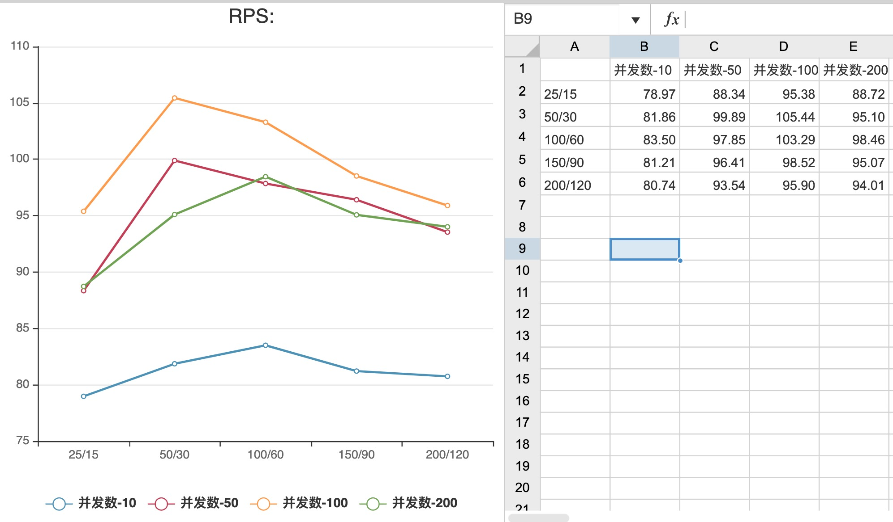

## 不同框架对比
| web             | -w  | 总请求数 | 并发数 | cpu | rps    | Failed | 50%   | 90%   | 100%  | url              |
| --------------- | --- | -------- | ------ | --- | ------ | ------ | ----- | ----- | ----- | ---------------- |
| Flask(gunicorn) | 1   | 500      | 10     | 17  | 5.22   | 0      | 1913  | 2299  | 2876  | /v1/users/labels |
| tornado         | 1   | 500      | 10     | 22  | 3.43   | 0      | 2859  | 3201  | 4430  | /v1/users/labels |
| Flask(gunicorn) | 1   | 5000     | 100    | 18  | 6.60   | 0      | 15049 | 17715 | 26450 | /v1/users/labels |
| tornado         | 1   | 5000     | 100    | 24  | 4.17   |        | 23814 | 25818 | 37544 | /v1/users/labels |
| Flask(Werkzeug) | 1   | 5000     | 100    | 22  | 318.68 | 0      | 319   | 357   | 506   | /v1/users/tags   |
| Flask(gunicorn) | 1   | 5000     | 100    | 21  | 595.62 | 0      | 156   | 211   | 577   | /v1/users/tags   |
| tornado         | 1   | 5000     | 100    | 21  | 784.08 | 0      | 117   | 163   | 246   | /v1/users/tags   |
| Twisted         | 1   | 5000     | 100    | 13  | 211.08 | 0      | 471   | 498   | 687   | /v1/users/tags   |
| Flask(gunicorn) | 1   | 500      | 10     | 8.5 | 337.52 | 0      | 22    | 32    | 49    | /v1/users/tags   |
| tornado         | 1   | 500      | 10     | 8.2 | 381.57 | 0      | 25    | 34    | 51    | /v1/users/tags   |
| Twisted         | 1   | 500      | 10     | 11  | 201.09 | 0      | 49    | 57    | 76    | /v1/users/tags   |
|                 |     |          |        |     |        |        |       |       |       |                  |

* rps: Requests per second
* 50%: Percentage of the requests served within a certain time(ms)

* url
  * /v1/users/labels: 接口负责, 查库操作很多(未加缓存)
  * /v1/users/tags:  接口简单, 只查询一次数据库

| web     | celery -c | 总请求数 | 并发数 | used cpu | RPS    | Failed | 50%  | 90%  | 100% | executor(rpc/celery) |
| ------- | --------- | -------- | ------ | -------- | ------ | ------ | ---- | ---- | ---- | -------------------- |
| tornado | 10        | 5000     | 10     | 21       | 78.97  | 0      | 122  | 155  | 263  | 25/15                |
| tornado | 10        | 5000     | 50     | 22       | 88.34  | 0      | 553  | 637  | 859  | 25/15                |
| tornado | 10        | 5000     | 100    | 22       | 95.38  | 0      | 1048 | 1154 | 1463 | 25/15                |
| tornado | 10        | 5000     | 200    | 22       | 88.72  | 0      | 2194 | 2439 | 2606 | 25/15                |
| tornado | 10        | 5000     | 10     | 22       | 81.86  | 0      | 121  | 146  | 237  | 50/30                |
| tornado | 10        | 5000     | 50     | 22       | 99.89  | 0      | 495  | 578  | 864  | 50/30                |
| tornado | 10        | 5000     | 100    | 22       | 105.44 | 0      | 947  | 1058 | 1406 | 50/30                |
| tornado | 10        | 5000     | 200    | 22       | 95.10  | 0      | 2090 | 2248 | 2824 | 50/30                |
| tornado | 10        | 5000     | 10     | 21       | 83.50  | 0      | 118  | 144  | 262  | 100/60               |
| tornado | 10        | 5000     | 50     | 22       | 97.85  | 0      | 504  | 607  | 812  | 100/60               |
| tornado | 10        | 5000     | 100    | 21       | 103.29 | 0      | 936  | 1070 | 1302 | 100/60               |
| tornado | 10        | 5000     | 200    | 22       | 98.46  | 0      | 2037 | 2144 | 2465 | 100/60               |
| tornado | 10        | 5000     | 10     | 21       | 81.21  | 0      | 121  | 147  | 263  | 150/90               |
| tornado | 10        | 5000     | 50     | 22       | 96.41  | 0      | 491  | 601  | 2551 | 150/90               |
| tornado | 10        | 5000     | 100    | 22       | 98.52  | 0      | 991  | 1140 | 1441 | 150/90               |
| tornado | 10        | 5000     | 200    | 22       | 95.07  | 0      | 2114 | 2215 | 2838 | 150/90               |
| tornado | 10        | 5000     | 10     | 21       | 80.74  | 0      | 122  | 147  | 227  | 200/120              |
| tornado | 10        | 5000     | 50     | 21       | 93.54  | 0      | 521  | 624  | 1026 | 200/120              |
| tornado | 10        | 5000     | 100    | 22       | 95.90  | 0      | 1015 | 1150 | 2273 | 200/120              |
| tornado | 10        | 5000     | 200    | 22       | 94.01  | 0      | 2125 | 2237 | 2504 | 200/120              |
| tornado | 100       | 5000     | 10     | 21       | 83.78  | 0      | 119  | 143  | 250  | 50/30                |
| tornado | 100       | 5000     | 50     | 22       | 101.75 | 0      | 484  | 574  | 759  | 50/30                |
| tornado | 100       | 5000     | 100    | 22       | 103.58 | 0      | 951  | 1105 | 1365 | 50/30                |
| tornado | 100       | 5000     | 200    | 21       | 92.25  | 0      | 2165 | 2304 | 2950 | 50/30                |

* rps: Requests per second
* 50%: Percentage of the requests served within a certain time(ms)
* 本次请求操作:
  * redis(第一次查询MongoDB)
  * postgres
  * rpc
  * client
* executor(rpc/celery)
  * executor = ThreadPoolExecutor(max_workers=50)
  * 线程池大小

### 曲线图
> **1. rps 曲线图**

> **2. 90 % requests 曲线图**
