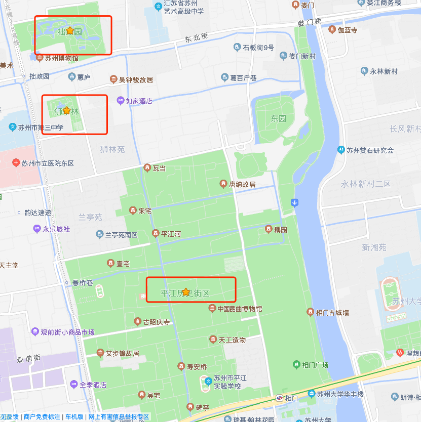

12:55 落地(浦东机场)

# 上海
## 吃
1. 令谷花开 惊世料理(湖北路131号)
   1. 记得提前预约, 也可以在线排队
   2. 澳洲顶级铺天盖地火牛寿司
   3. 汉男超级爆汁炸鸡
   4. 巨乳芝士瀑布甘薯
   5. 明太子烤土豆
   6. 赤焰三帝盖饭
2. fine cafe&canteen minna(愚园路769-1号)
   1. 日式抹茶白玉丸子舒芙蕾松饼
   2. 肉桂栗子舒芙蕾
3. Blueglass(上生新所店)
   1. 酸奶


## 时刻表

```sequence
浦东机场 --> 浦东机场: 会和 12:55~13:10
浦东机场 -> 令谷花开: 🚇 13:10~14:25
令谷花开 --> 令谷花开: 🍚 14:30~15:30

```

&nbsp;
&nbsp;
&nbsp;
&nbsp;
&nbsp;
&nbsp;
&nbsp;
&nbsp;
&nbsp;
&nbsp;
&nbsp;
&nbsp;
&nbsp;
&nbsp;
&nbsp;
&nbsp;
&nbsp;
&nbsp;

# 苏州

## 游
#### 分布
* 

1. **拙政园**
   * 

&nbsp;
&nbsp;
&nbsp;

2. **平江路**
   * 
3. **狮子林**
   * 
4. 诚品书店
5. 李公堤
6. 苏州御窑金砖博物馆
   1. 展示了金砖的生产工具、历史上漕运过程


## 吃
1. 吴门人家
   1. 糖粥
   2. 松鼠鳜鱼
   3. 樱桃肉
   4. 八宝鸭
2. 得月楼
   1. 近些年松鹤楼得月楼的苏帮菜水准都下降得厉害
   2. 荷叶粉蒸肉
   3. 松鼠桂鱼
   4. 碧螺虾仁
   5. 樱桃肉
3.  协和菜馆
    1.  龙井虾仁
    2.  松鼠鳜鱼
4. 珍珠饭店
   1. 椒盐排条
   2. 咕咾肉
   3. 木桶肥牛
   4. 葱油拌面
5. 双塔点心铺(凤凰街双塔菜市场大门处)
   1. 豆腐花、葱油饼
6. 老西白点心店(白塔西路104号)
   1. 生煎、汤圆
7. 新年点心店(山塘街351号)
   1. 鲜肉汤团、小馄饨
8. 荣阳楼(山塘街329号)
   1. 油氽团子、生煎
9.  鸡脚旮旯(平江路中段邾长巷)
    1.  鸡脚、鸭胗
    2.  说是模仿 祥鑫
10. 祥鑫饮食店
    1.  貌似只收现金
    2.  鸡爪
    3.  广受好评
11. 姑苏特色小吃店(大儒巷53号（近平江路）)
    1.  蟹壳黄
12. 鱼食饭稻土灶馆(平江路68-76号)
    1.  鸡头米炒百合
    2.  剁椒鱼头
    3.  豆腐
    4.  椒麻鸡
13. 随柳居(建新巷店)
    1.  桂花糖粥、荠菜馄饨、桂花赤豆糊、桂花糖芋艿
14. 黄天源
    1.  糕团、薄荷糕、玫瑰松饼
    2.  面
15. 石家饭店
    1.  酱方
    2.  清炒河虾仁
    3.  三虾豆腐
    4.  鲃肺汤